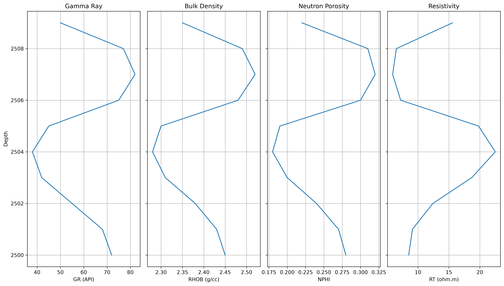
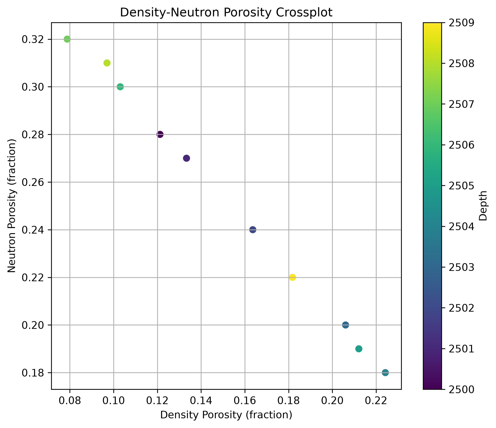
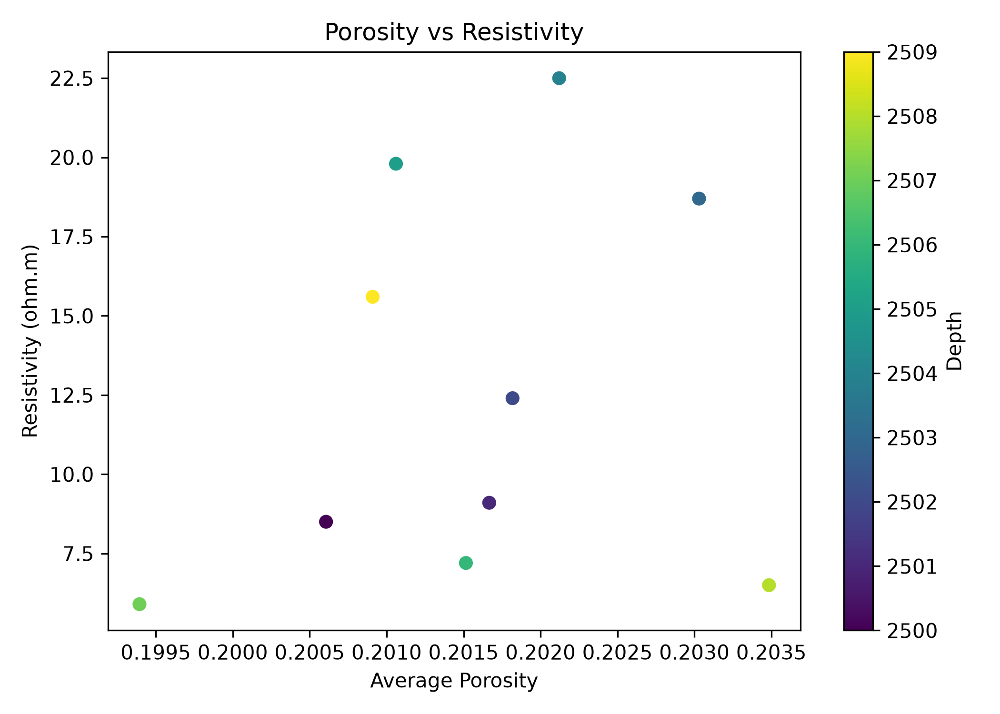
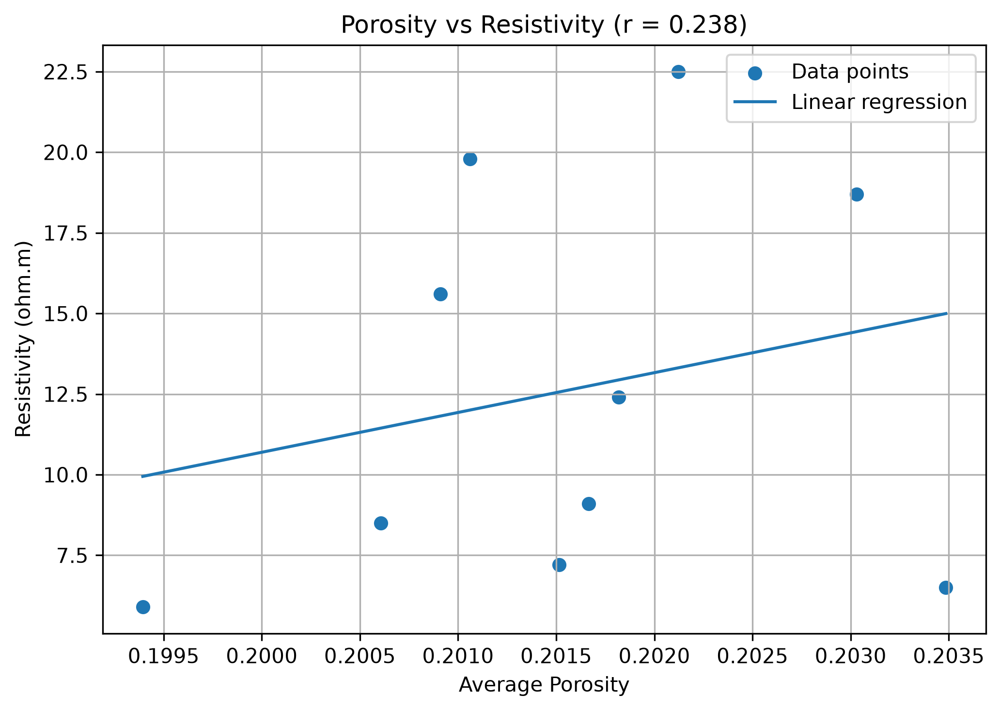
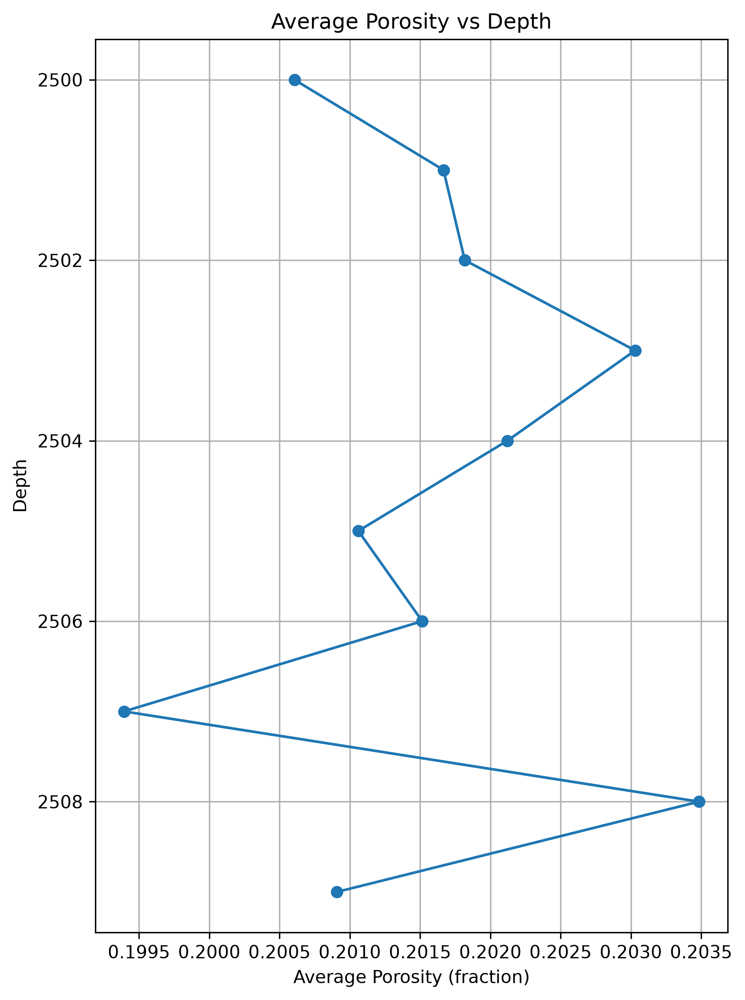
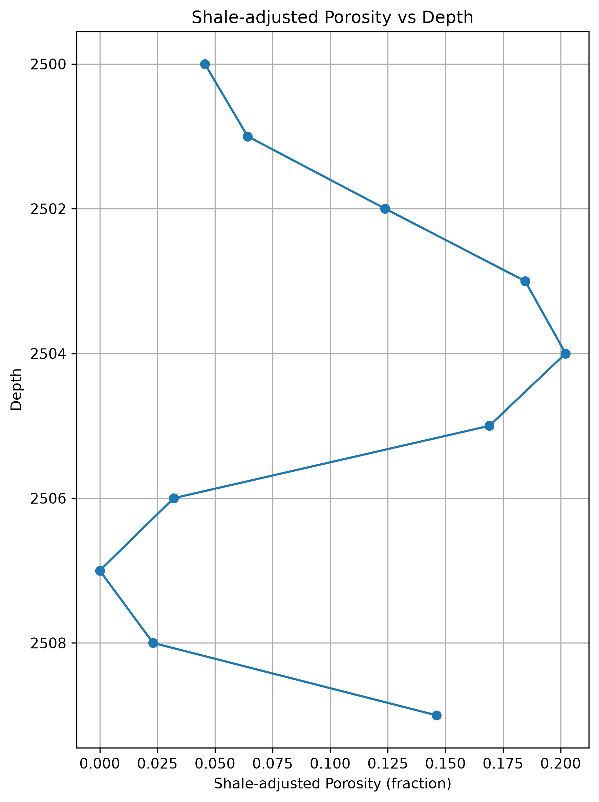
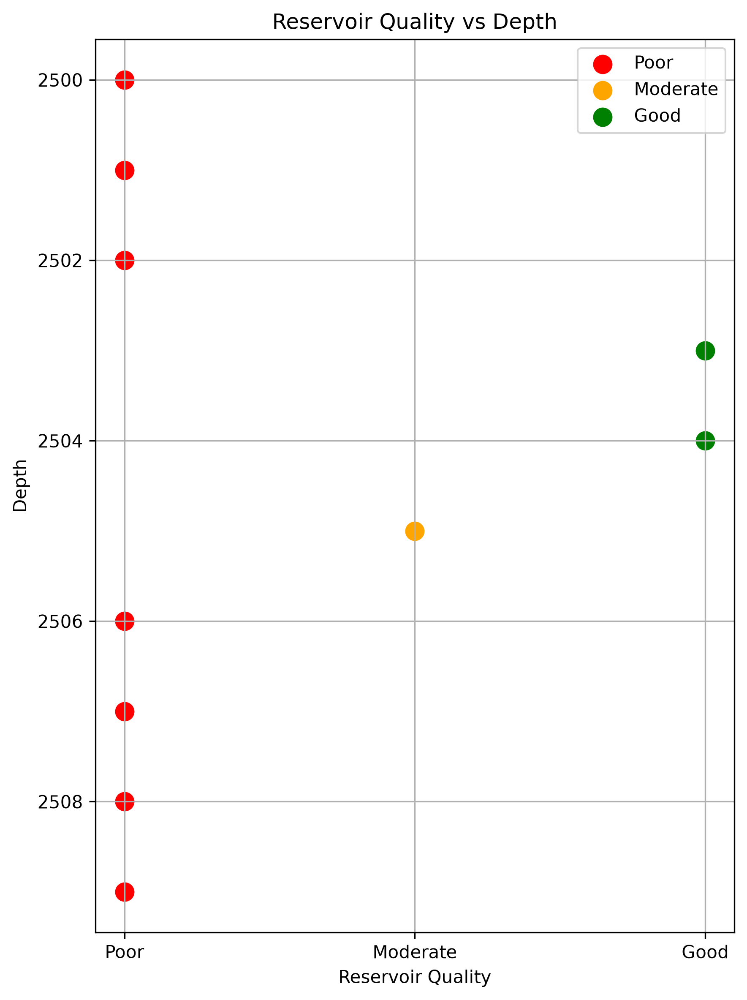

# Python Well Log Analysis

A Python-based petrophysical workflow for synthetic well-log evaluation, including shale volume estimation, porosity calculation, reservoir screening, reservoir quality classification, and petrophysical crossplots.

## Key Skills Demonstrated

- Python data analysis with Pandas and NumPy
- Petrophysical evaluation from well-log data
- Shale volume and porosity estimation
- Reservoir interval screening and quality classification
- Crossplot and correlation analysis
- Data visualization with Matplotlib
- Export of interpreted results to CSV

## Overview
This project demonstrates a basic petrophysical workflow for well log analysis using Python.

The objective is to process well log data, calculate key petrophysical parameters, identify potential reservoir intervals, and classify reservoir quality.

The workflow is designed as a practical portfolio project combining petroleum engineering knowledge with Python-based data analysis.

---

## Project Objectives

- Load and analyze well log data using Python
- Perform basic statistical evaluation of well logs
- Calculate Gamma Ray shale volume (VSH)
- Estimate density porosity
- Compare density and neutron porosity responses
- Calculate shale-adjusted net porosity
- Identify potential reservoir intervals
- Classify reservoir quality based on petrophysical cutoffs
- Generate summary results for reservoir intervals

---

## Input Data

The project uses well log data containing:

- Depth (DEPTH)
- Gamma Ray (GR)
- Bulk Density (RHOB)
- Neutron Porosity (NPHI)
- Resistivity (RT)

Note:
The dataset included in this repository is synthetic and intended for educational and demonstration purposes.

---

## Petrophysical Workflow

### 1. Gamma Ray Analysis

Gamma Ray data is used to estimate shale volume:

- Gamma Ray Index
- Linear shale volume calculation (VSH_GR)
- Identification of potential shale intervals

---

### 2. Porosity Evaluation

Calculated parameters:

- Density Porosity (PHI_D)
- Neutron Porosity (NPHI)
- Average Porosity (PHI_AVG)

Density-neutron comparison is used to evaluate porosity behavior.

---

### 3. Net Porosity Calculation

Shale-adjusted porosity is calculated using:

Net Porosity = Average Porosity × (1 - VSH)

---

### 4. Reservoir Identification

Potential reservoir intervals are selected based on:

- Low shale volume
- Higher net porosity
- Higher resistivity response

---

### 5. Reservoir Quality Classification

Reservoir intervals are classified into:

- Poor
- Moderate
- Good

based on predefined petrophysical criteria.

## Visualizations

### Well Log Overview



### Density-Neutron Porosity Crossplot



### Porosity vs Resistivity


### Porosity-Resistivity Correlation



### Average Porosity vs Depth



### Shale-adjusted Porosity vs Depth



### Reservoir Quality vs Depth



---

## Output

The project generates:

- Petrophysical summary table
- Reservoir quality classification
- Reservoir interval summary

Example output:

`reservoir_interval_summary.csv`

---
## How to Run

1. Clone the repository:

```bash
git clone https://github.com/saeedshaterian/Python--well-log-analysis.git
```

2. Navigate to the project directory:

```bash
cd Python--well-log-analysis
```

3. Install the required Python packages:

```bash
pip install -r requirements.txt
```

4. Run the analysis script:

```bash
python well_log_analysis.py
```

The script reads the synthetic well-log dataset, performs the petrophysical analysis, generates the visualizations, and saves the final evaluation results as CSV files.

## Technologies Used

- Python
- Pandas
- NumPy
- Matplotlib

---
## Results & Interpretation

The analysis identifies a potential reservoir interval based on shale volume, shale-adjusted porosity, and resistivity criteria.

Key results from the synthetic dataset:

- The interpreted reservoir interval extends from approximately 2503 to 2505 depth units.
- The interval contains three reservoir-flagged data points.
- Average net porosity within the interpreted reservoir interval is approximately 0.185.
- Average resistivity within the interpreted reservoir interval is approximately 20.3 ohm.m.
- The calculated Net-to-Gross ratio (NTG) is approximately 33.3%.
- Reservoir quality classification identifies the upper two points as "Good" and the third as "Moderate" according to the predefined project criteria.
- The Pearson correlation coefficient between average porosity and resistivity is approximately 0.238, indicating a weak positive linear association in this synthetic dataset.

These results are intended for educational and portfolio demonstration purposes. The reservoir flags, quality thresholds, and NTG calculation are simplified project-specific criteria and should not be interpreted as a field-scale reservoir evaluation workflow.

## Project Structure

    Python--well-log-analysis/
    |-- well_log_analysis.py
    |-- well_log_data.csv
    |-- petrophysical_evaluation.csv
    |-- reservoir_interval_summary.csv
    |-- requirements.txt
    |-- README.md
    |-- .gitignore
    |-- well_log_overview.png
    |-- density_neutron_crossplot.png
    |-- average_porosity_vs_depth.png
    |-- porosity_resistivity_crossplot.png
    |-- porosity_resistivity_correlation.png
    |-- shale_adjusted_porosity_vs_depth.png
    `-- reservoir_quality_vs_depth.png

---

## Author

Saeed Shaterian Bidgoli

Petroleum Engineer | Reservoir Characterization | Petrophysics | Subsurface Data Analytics